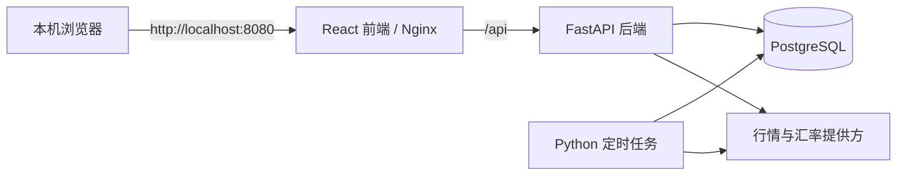

# 个人资产配置与再平衡系统 V1 设计文档

## 文档信息

| 项目 | 内容 |
| --- | --- |
| 项目名称 | Portfolio Rebalancer |
| 文档版本 | V1.1 |
| 日期 | 2026-07-13 |
| 状态 | 已实现 |
| 部署方式 | Docker Desktop，本机访问 |
| 默认时区 | Asia/Shanghai |

## 1. 背景

现有资产配置通过 Excel 维护，核心问题包括：持仓录入不够顺手、价格和汇率需要手工更新、难以持续区分资产价格变化与汇率变化、成本维护容易出错，以及再平衡和历史变化缺少统一记录。

V1 将这些能力整合为一个本机自托管 Web 应用。系统服务于长期资产配置，不承担交易终端、完整投资记账或税务系统的职责。

## 2. 目标

V1 必须实现以下目标：

1. 维护核心资产类别、目标比例、标的、份额和平均成本。
2. 自动获取国内 ETF、黄金、SPY、QQQ 和 USD/CNY 的日线级数据。
3. 同时计算实际人民币占比和剔除汇率影响后的占比。
4. 计算当前持仓的浮动盈亏，并拆分价格影响和汇率影响。
5. 通过追加买入计算器准确维护平均成本价和成本汇率。
6. 根据新增人民币、美元和可选卖出规则生成再平衡建议。
7. 保存日终、手动和再平衡事件快照，展示长期变化。
8. 通过 Docker Desktop 在本机稳定运行，并可备份和恢复数据。

## 3. 非目标

V1 明确不包含：

- 登录、用户系统、权限管理和局域网访问。
- 公网访问、HTTPS 和移动端专用应用。
- 券商账户同步、自动下单和订单状态跟踪。
- 完整交易流水、已实现盈亏、税务计算和报税数据。
- 时间加权收益率、资金加权收益率和精确的组合历史回报率。
- 债券、现金理财和长期现金仓位管理。
- 现金分红记账；分红再投资按一次追加买入处理。
- CSV、Excel 导入。

## 4. 核心策略

系统首次初始化时提供以下默认资产类别和目标比例，用户可以修改名称、顺序和比例，但启用资产的目标比例之和必须等于 100%。

| 资产类别 | 默认目标比例 |
| --- | ---: |
| 红利低波 | 20% |
| 红利质量 | 20% |
| 标普 500 | 30% |
| 纳斯达克 100 | 20% |
| 黄金 | 10% |

债券和现金理财位于系统之外。再平衡时，用户只临时输入本次准备投入的人民币和美元，不将这些资金保存为长期资产仓位。

## 5. 术语与口径

所有汇率统一使用“1 单位交易币种等于多少人民币”的直接标价法。例如 USD/CNY 为 7.20，表示 1 美元等于 7.20 元人民币。人民币资产的汇率固定为 1。

### 5.1 成本汇率

取得当前持仓时，对应的人民币平均资金成本汇率。它用于盈亏计算，只在新增买入、证券转入或人工修正成本时变化，不随市场汇率每日变化。

### 5.2 当前汇率

最新有效的交易币种兑人民币汇率，用于计算当前人民币市值和实际人民币占比。

### 5.3 基准汇率

用于隔离汇率波动的参考汇率。首次录入持仓时建立初始基准；普通追加买入不改变基准；完成一次正式再平衡后，由用户确认统一建立新基准。

### 5.4 实际占比

按照当前价格和当前汇率计算，表示用户当前真实承担的人民币资产敞口。

### 5.5 剔汇率占比

按照当前价格和基准汇率计算，用来判断自上次基准建立以来，资产价格本身造成的配置偏离。

## 6. 总体架构

采用前后端分离架构。所有投资计算和业务规则由后端负责，前端不重复实现公式。



Docker Compose 包含四个服务：

| 服务 | 职责 |
| --- | --- |
| `frontend` | 构建并提供 React 页面，将 `/api` 请求反向代理到后端 |
| `api` | 提供 API、校验输入、执行成本、盈亏、配置和再平衡计算 |
| `worker` | 定时刷新行情和汇率，生成自动快照 |
| `db` | PostgreSQL，保存业务数据和历史快照 |

部署约束：

- `frontend` 只绑定宿主机 `127.0.0.1:8080`。
- `api`、`worker` 和 `db` 只加入 Docker 内部网络，不暴露数据库端口。
- 数据库使用 Docker 命名卷持久化。
- 应用不发送遥测数据。
- 可选 API 密钥只保存在后端，不写入浏览器本地存储，不输出到日志。首次启动时生成本机加密密钥并保存在独立 Docker 卷中，数据源密钥经过认证加密后再写入数据库。

## 7. 后端模块边界

| 模块 | 职责 |
| --- | --- |
| 资产配置 | 资产类别、目标比例、顺序和启用状态 |
| 持仓 | 标的信息、账户、币种、份额和成本字段 |
| 成本引擎 | 追加买入、部分卖出和人工修正的预览与确认 |
| 市场数据 | 行情和汇率提供方适配、缓存、手动覆盖和数据有效性 |
| 分析引擎 | 市值、占比、盈亏、价格影响和汇率影响 |
| 再平衡引擎 | 现金优先、卖出可选、换汇和交易约束优化 |
| 快照 | 自动、手动和再平衡事件快照 |
| 设置与运维 | 数据源配置、刷新计划、备份、恢复和健康检查 |

每个模块通过明确的服务接口协作。提供方适配器不得直接修改持仓；再平衡引擎只产生建议，不修改份额和成本。

## 8. 数据模型

### 8.1 资产类别 `asset_classes`

| 字段 | 说明 |
| --- | --- |
| `id` | 主键 |
| `name` | 资产类别名称 |
| `target_weight` | 目标比例，使用高精度十进制 |
| `display_order` | 展示顺序 |
| `is_active` | 是否启用 |
| `notes` | 可选备注 |

约束：所有启用类别的 `target_weight` 之和必须为 1。

### 8.2 持仓 `holdings`

| 字段 | 说明 |
| --- | --- |
| `id` | 主键 |
| `asset_class_id` | 所属资产类别 |
| `symbol` | 标的代码，例如 SPY、QQQ |
| `name` | 标的名称 |
| `market` | 上市市场 |
| `account_name` | 账户或券商名称 |
| `trade_currency` | 交易币种，例如 CNY、USD |
| `quantity` | 当前份额 |
| `average_cost_price` | 含费用后的平均成本价，按交易币种计价 |
| `cost_fx_to_cny` | 成本汇率 |
| `baseline_fx_to_cny` | 基准汇率 |
| `lot_size` | 再平衡建议使用的最小交易单位 |
| `quantity_precision` | 允许的小数位数 |
| `is_rebalance_preferred` | 同类存在多个标的时，是否为默认调整标的 |
| `is_active` | 是否仍持有或启用 |

一个资产类别可以包含多个持仓，但同一类别最多有一个默认再平衡标的。若只有一个持仓，该持仓自动成为默认标的。

### 8.3 标的默认配置 `holding_defaults`

| 字段 | 说明 |
| --- | --- |
| `holding_id` | 对应持仓 |
| `fee_currency` | 交易币种或 CNY |
| `commission_rate` | 按成交金额计算的费率 |
| `minimum_commission` | 最低佣金 |
| `per_share_fee` | 每份费用 |
| `fixed_fee` | 固定平台费或其他固定费用 |
| `default_data_source` | 首选行情来源 |

交易币种、账户、最小交易单位等直接继承持仓，不要求每次重新填写。新增份额、实际成交价、成交日期和实际费用属于单次输入，不保存为下次默认交易数据。

### 8.4 市场数据 `market_data`

保存自动抓取的价格和汇率：

- 数据类型：价格或汇率。
- 标的代码或货币对。
- 数值、来源、市场数据时间和抓取时间。
- 状态：有效、过期或抓取失败。
- 错误摘要，不保存密钥和敏感请求信息。

### 8.5 手动覆盖 `market_data_overrides`

手动价格和汇率与自动数据分开保存，包含数值、原因备注、生效时间和可选失效时间。失效时间为空表示持续生效，直到用户主动取消。

有效值解析顺序为：

1. 当前生效的手动覆盖。
2. 最新有效的自动数据。
3. 上一次有效数据，并标记为过期。

### 8.6 成本调整记录 `cost_adjustments`

记录初始录入、追加买入、部分卖出、清仓和人工修正。每条记录保存操作前后的份额、成本价、成本汇率、输入摘要、时间和备注。

该表是可恢复的审计记录，不是完整交易流水，不计算已实现盈亏。

### 8.7 快照 `snapshots` 与 `snapshot_items`

快照头记录类型、时间、备注、数据完整性和是否存在过期数据。快照明细保存当时的持仓、价格、当前汇率、基准汇率、成本、占比和盈亏结果。

快照类型：

- `daily`：每日自动快照，同一日期只保留一份并进行更新。
- `manual`：用户手动创建，永久保留。
- `rebalance_before`：正式再平衡开始前创建。
- `rebalance_after`：正式再平衡完成后创建。

### 8.8 再平衡方案 `rebalance_plans`

保存方案输入、数据版本、建议明细、预计结果和状态。状态包括草稿、已确认完成和已取消。方案记录用于解释历史决策，不代表系统执行过交易。

### 8.9 系统设置 `settings`

保存刷新计划、数据源优先级、默认偏离阈值、最小交易金额、是否允许卖出和是否允许换汇等非敏感配置。可选数据源密钥由独立的加密配置记录保存，页面只展示掩码和验证状态。加密密钥不得与数据库备份存放在同一个文件中。

## 9. 核心计算

所有金额和比例计算使用十进制定点数，不使用二进制浮点数作为财务计算的最终结果。数据库保留足够精度，前端只在展示时四舍五入。

设：

- `Q`：份额。
- `P_cost`：平均成本价。
- `P_now`：当前价格。
- `R_cost`：成本汇率。
- `R_now`：当前汇率。
- `R_base`：基准汇率。

### 9.1 市值与占比

```text
当前人民币市值 = Q × P_now × R_now
剔汇率影响市值 = Q × P_now × R_base

实际占比 = 当前人民币市值 ÷ 核心池当前人民币总市值
剔汇率占比 = 剔汇率影响市值 ÷ 核心池剔汇率影响总市值
汇率占比影响 = 实际占比 - 剔汇率占比
```

占比先按持仓计算，再按资产类别汇总。未投入的临时现金不进入核心池分母。

### 9.2 浮动盈亏

```text
人民币成本 = Q × P_cost × R_cost
当前人民币市值 = Q × P_now × R_now
浮动盈亏 = 当前人民币市值 - 人民币成本
浮动收益率 = 浮动盈亏 ÷ 人民币成本

按成本汇率计算的当前市值 = Q × P_now × R_cost
价格影响 = 按成本汇率计算的当前市值 - 人民币成本
汇率影响 = 当前人民币市值 - 按成本汇率计算的当前市值
```

因此：

```text
浮动盈亏 = 价格影响 + 汇率影响
```

费用计入平均成本价，因此会自然反映为成本的一部分。人民币资产的 `R_cost`、`R_now` 和 `R_base` 均为 1，汇率影响为 0。

### 9.3 追加买入成本

设原持仓为 `Q0`、`P0`、`R0`；本次买入份额、成交价和实际购汇成本汇率为 `q`、`p`、`r`。

费用支持规则预估和交割单实际费用。若填写实际费用，实际费用覆盖预估值。费用只允许以交易币种或人民币录入。

设交易币种费用为 `F_trade`，人民币费用为 `F_cny`：

```text
原交易币种成本 = Q0 × P0
本次交易币种等价成本 = q × p + F_trade + F_cny ÷ r

原人民币成本 = Q0 × P0 × R0
本次人民币成本 = q × p × r + F_trade × r + F_cny

新份额 = Q0 + q
新平均成本价 =
  (原交易币种成本 + 本次交易币种等价成本) ÷ 新份额

新成本汇率 =
  (原人民币成本 + 本次人民币成本)
  ÷ (原交易币种成本 + 本次交易币种等价成本)
```

该定义保证：

```text
新份额 × 新平均成本价 × 新成本汇率
= 原人民币成本 + 本次人民币成本
```

预估费用规则为：

```text
预估费用 =
  max(成交金额 × 佣金费率, 最低佣金)
  + 买入份额 × 每份费用
  + 固定费用
```

费率、最低佣金、每份费用和固定费用均允许为 0。

### 9.4 部分卖出与清仓

- 部分卖出只减少份额，平均成本价和成本汇率保持不变。
- 卖出费用不进入剩余持仓成本。
- V1 不计算该笔卖出的已实现盈亏。
- 份额变为 0 时，持仓标记为已清仓，成本价和成本汇率归零；历史调整记录保留。

## 10. 成本计算器交互

成本计算器位于“持仓与成本”页面，每个持仓提供以下操作：

### 10.1 追加买入

1. 自动带出账户、币种、最新价格、当前汇率和该标的费用规则。
2. 用户输入新增份额和成交日期，可修改成交价和汇率。
3. 系统展示预估费用；用户可以录入交割单实际总费用。
4. 系统只生成预览，展示调整前后份额、平均成本价、成本汇率和人民币成本。
5. 用户确认后更新持仓并写入成本调整记录。
6. 用户本次修改的费用规则可选择保存为该标的新默认值；实际成交数据不会成为默认值。

### 10.2 部分卖出

输入卖出份额后预览剩余份额。确认后只更新份额并写入调整记录，同时明确提示“不计算已实现盈亏”。

### 10.3 人工修正

允许直接修正份额、成本价和成本汇率，但必须填写原因。系统展示修改前后差异并支持通过调整记录恢复。恢复操作不会删除或改写原记录，而是以选中记录的状态为目标，经过预览后创建一条新的人工修正记录。

## 11. 行情与汇率

### 11.1 默认提供方

| 数据 | 默认来源 | 可选来源 |
| --- | --- | --- |
| 国内 ETF 和黄金 | AKShare 支持的数据接口 | Tushare Pro |
| SPY、QQQ | Yahoo Finance | Alpha Vantage |
| USD/CNY | Yahoo Finance | Alpha Vantage |

数据源优先级可配置。未配置 API 密钥时，系统必须能够使用默认免密钥来源运行。

### 11.2 刷新规则

- V1 使用最近收盘价或延迟数据，不承诺盘中实时行情。
- worker 默认每天 `08:00 Asia/Shanghai` 尝试刷新全部数据。
- 打开再平衡页面时额外尝试刷新一次。
- 用户可以手动刷新全部数据或单个标的。
- 若来源没有出现新的市场日期，不重复创建新的自动快照内容。

### 11.3 失败和降级

- 抓取失败不得将有效值覆盖为空值。
- 页面显示每个值的来源、市场数据时间、抓取时间和状态。
- 自动数据失败时继续使用上一次有效值并标记过期。
- 存在过期核心数据时仍可进行模拟，但再平衡结果必须显示显著警告并要求用户确认数据风险。
- 自动刷新继续保存后台值，但生效中的手动覆盖拥有更高优先级，直到覆盖失效或被取消。

## 12. 基准汇率生命周期

### 12.1 初始建立

首次录入持仓时，基准汇率默认采用当时最新有效汇率，用户可以在确认前修改。人民币资产固定为 1。

### 12.2 普通追加买入

追加买入只更新成本价和成本汇率，不修改基准汇率，以免普通定投切断汇率影响观察周期。

### 12.3 正式再平衡

1. 生成再平衡方案并保存 `rebalance_before` 快照。
2. 用户在券商完成交易。
3. 用户通过成本计算器或人工修正更新持仓。
4. 用户点击“完成再平衡并建立新基准”。
5. 系统保存 `rebalance_after` 快照。
6. 系统将所有活跃持仓的基准汇率统一更新为该时点的最新有效汇率。

旧基准保存在快照中，不会因重设基准而丢失。

## 13. 再平衡引擎

### 13.1 输入

- 本次可用人民币。
- 本次可用美元。
- 计算口径：默认实际人民币占比，可切换剔汇率模拟。
- 是否允许卖出。
- 是否允许人民币与美元换汇。
- 允许偏离阈值，默认正负 2 个百分点。
- 最小交易金额。
- 各标的最小交易单位和份额精度。

这些现金金额只参与本次计算，不保存为长期现金仓位。

### 13.2 规则

1. 按资产类别汇总当前市值和偏离。
2. 将临时人民币和美元按当前有效汇率折算，得到本次计划投入后的预计可投资总额，并据此计算各资产类别的目标金额。
3. 优先使用同币种新增现金补充低配类别。
4. 美元不足且允许换汇时，计算建议人民币购汇金额。
5. 新增资金用完后，如果仍存在超过阈值的高配类别，且允许卖出，才生成卖出建议。
6. 卖出产生的同币种资金优先用于同币种买入，减少换汇。
7. 应用最小交易金额、最小交易单位和份额精度后重新计算预计占比。
8. 因交易单位无法完全补齐时，保留未投入现金并明确展示；最终交易后占比只以实际进入核心持仓的资金为分母。

### 13.3 优化目标

满足硬约束后，按以下优先顺序选择方案：

1. 尽可能使资产类别回到允许偏离范围内。
2. 尽量减少总卖出金额和总换手。
3. 尽量减少换汇金额。
4. 尽量减少交易笔数。

### 13.4 输出

每条建议包含：

- 买入或卖出。
- 标的、账户和交易币种。
- 建议份额、交易币种金额和人民币参考金额。
- 是否需要换汇及参考换汇金额。
- 建议前后资产类别占比。
- 建议原因和剩余偏差。

系统同时展示实际口径和剔汇率口径的对照。如果偏离主要由汇率造成，应明确提示，但默认交易建议仍以实际人民币占比为依据。

汇率和费用仅用于估算，不代表券商最终成交结果。系统不连接券商，也不会自动执行建议。

## 14. 历史快照

### 14.1 自动快照

自动刷新成功且核心数据完整时生成当日快照。同一自然日重复成功刷新时更新该日自动快照，不新增重复记录。

### 14.2 手动快照

用户可以随时保存并填写备注。若存在过期或手动覆盖数据，快照必须记录相应状态。

### 14.3 再平衡快照

正式再平衡前后各保存一份不可被自动任务覆盖的事件快照，并与对应方案关联。

### 14.4 历史展示

历史页面支持查看：

- 核心池人民币市值。
- 人民币成本和浮动盈亏。
- 资产类别实际占比和目标比例。
- 剔汇率占比和汇率占比影响。
- 价格影响和汇率影响。
- 再平衡事件和手动备注。

历史曲线表示各快照时点的持仓状态，不应标注为精确组合收益率。

## 15. 前端体验与视觉设计

### 15.1 设计主题

前端视觉主题确定为“组合校准台”。具体对象是一位长期维护五类资产的个人投资者；首页的单一任务是回答“现在是否需要行动，以及偏离主要来自价格还是汇率”。

界面应当像一张可核对、可反复使用的校准工作台，而不是营销型理财仪表盘、交易行情终端或内容型财经网站。所有页面都优先服务扫描、比较和执行。

最终视觉方向经过三种方案比较后确定：

- 采用浅色、冷静、桌面优先的工作界面。
- 使用左侧固定导航和顶部数据状态栏。
- 以资产校准尺作为唯一标志性视觉语言。
- 不使用衬线标题、渐变、装饰性插图、大面积深色终端风或彩色卡片墙。
- 不通过超大数字制造“英雄区”，首页首先呈现行动判断。

### 15.2 设计令牌

核心色彩限制为六种。普通边框、禁用态和表面色从中降低透明度或明度派生，不再增加竞争性的主题色。

| 名称 | 色值 | 用途 |
| --- | --- | --- |
| 校准纸 | `#EEF2EE` | 页面背景、低对比区域 |
| 墨色 | `#18221D` | 主文字、结构线和高优先级信息 |
| 实际蓝 | `#2F5DA8` | 当前实际占比、主要操作和键盘焦点 |
| 汇率红 | `#C94A3A` | 剔汇率标记、超配风险和错误状态 |
| 目标金 | `#B58B2A` | 目标刻线、允许区间和需要注意的说明 |
| 计划绿 | `#2E7458` | 调整后占比、有效状态和正向结果 |

主内容表面使用接近白色的 `#FBFCFA`。颜色必须与文字、符号或形状共同表达含义，不能单独承担信息传递。

### 15.3 字体与数字

- 中文界面和标题使用本地打包的 `Noto Sans SC`，避免依赖外网字体服务。
- 金额、比例、汇率、代码和数据标签使用 `IBM Plex Mono`。
- 页面标题使用 18px，区块标题使用 12px 至 14px，正文使用 11px 至 13px。
- 主要金额最大不超过 28px，紧凑面板内不得使用英雄级字号。
- 数字使用等宽字体和表格数字特性，金额按位对齐。
- 字间距固定为 0；只允许英文数据标签使用自然的大写字形，不额外增加装饰性字距。

### 15.4 空间与形状

- 基础间距单位为 4px，主要页面内边距为 24px 或 28px。
- 桌面侧边栏宽 188px，顶部栏高 66px。
- 表格数据行高 48px 至 56px，保证扫描稳定。
- 控件高度统一为 34px、36px 或 38px三个层级。
- 卡片圆角不得超过 4px；默认使用分隔线和页面分区，不将每个指标包装成独立浮动卡片。
- 禁止卡片嵌套、装饰性阴影、渐变背景、光斑和无意义的彩色徽章。
- 阴影只用于右侧工作抽屉、确认弹窗等确实存在层级遮挡的界面。

### 15.5 标志性组件：资产校准尺

资产校准尺在总览和再平衡页面中表达目标、实际、剔汇率和预计调整后的关系：

- 目标比例使用目标金竖线。
- 允许偏离范围使用低透明度目标金色带。
- 当前实际占比使用实际蓝方形标记。
- 剔汇率占比使用较窄的汇率红标记。
- 再平衡后的预计占比使用计划绿菱形标记。
- 标记旁必须同时展示精确比例和偏离值。

总览默认以目标为中心展示正负 4 个百分点。若偏离超出显示范围，标记停在边缘并显示方向箭头和真实数值，不能通过压缩比例隐藏异常。

```text
资产        目标        目标 ±4pp 校准尺                  实际      偏离
标普 500    30.0%   ────────[允许区间]──│目标──■实际────   31.8%   +1.8pp
                                  ·剔汇率
```

该组件是全站唯一允许承担明显视觉个性的元素。其他图表、表格和控件保持安静，避免与其竞争。

### 15.6 应用外壳

左侧导航固定包含：总览、资产配置、持仓与成本、盈亏分析、再平衡、历史快照和数据源。实际实现使用 Lucide 图标加文字；图标按钮必须提供悬停提示和可访问名称。

顶部栏显示当前页面名称、数据口径、最近市场数据时间，以及刷新和保存快照等当前页面相关命令。系统状态放在侧边栏底部，不占用主工作区。

```text
┌──────────────┬────────────────────────────────────────────────────┐
│ 组合校准台   │ 页面名称                 数据时间   刷新   保存快照 │
├──────────────┼────────────────────────────────────────────────────┤
│ 总览         │                                                    │
│ 资产配置     │                当前页面工作区                       │
│ 持仓与成本   │                                                    │
│ 盈亏分析     │                                                    │
│ 再平衡       │                                                    │
│ 历史快照     │                                                    │
│ 数据源       │                                                    │
└──────────────┴────────────────────────────────────────────────────┘
```

### 15.7 总览页面

总览页面按以下顺序组织：

1. 行动判断条：显示“保持现状”“建议补仓”或“建议再平衡”，同时说明最大偏离和主要来源。
2. 汇总指标带：核心池市值、浮动盈亏、价格影响和汇率影响。
3. 资产校准尺：展示五类资产的目标、实际、剔汇率和偏离。
4. 盈亏拆分：展示价格影响、汇率影响和海外资产占比。
5. 数据状态条：展示国内行情、美股行情和 USD/CNY 的来源与时间。

行动判断条不是自动交易指令。主按钮根据状态使用“测算新增资金”或“查看再平衡建议”，不得使用含糊的“立即优化”等文案。

### 15.8 资产配置页面

- 使用单层可编辑表格维护资产类别、目标比例、顺序、启用状态和备注。
- 目标比例使用数值输入和百分比后缀，不使用自由拖拽作为唯一输入方式。
- 页面底部固定显示比例合计，未达到 100% 时明确显示差额并禁止保存。
- 启用状态使用开关；顺序使用可访问的上移、下移命令。
- 禁止删除有关联持仓或快照的类别，停用前显示影响范围。

### 15.9 持仓与成本页面

主区域使用持仓表格，展示标的、账户、币种、份额、成本价、成本汇率、当前价、当前汇率、市值和浮动盈亏。行操作使用图标按钮，追加买入使用加号图标，其他操作进入菜单。

点击追加买入后，从右侧打开工作抽屉，不离开持仓上下文。抽屉内信息顺序固定为：

1. 本次成交：新增份额、成交日期、成交价和本次汇率。
2. 交易费用：规则预估和实际费用使用分段控件切换。
3. 默认值：显示佣金费率、最低佣金、每份费用和固定费用，并允许保存为当前标的默认值。
4. 成本预览：并排展示调整前后的份额、成本价、成本汇率和人民币成本。
5. 公式校验：只有校验通过时才启用“更新标的持仓”。

```text
┌────────────────────────────持仓表格────────────────────┬───────────────┐
│ 标的  份额  成本价  成本汇率  当前价  市值  盈亏  操作 │ 追加买入 SPY  │
│ ...                                                     │ 本次成交      │
│ SPY   ...                                         [+]   │ 费用与默认值  │
│ ...                                                     │ 成本前后预览  │
│                                                         │ [更新持仓]    │
└─────────────────────────────────────────────────────────┴───────────────┘
```

部分卖出和人工修正沿用同一抽屉结构，但使用独立动作名称。确认按钮必须明确写成“更新 SPY 持仓”“确认卖出调整”等结果导向文案。

### 15.10 盈亏分析页面

- 页面顶部显示总成本、市值、浮动盈亏和收益率。
- 主图使用价格影响与汇率影响的时间序列或堆叠拆分，不使用装饰性环图。
- 下方表格按资产类别和标的展开成本、市值、浮动盈亏、收益率、价格影响和汇率影响。
- 人民币金额和交易币种金额使用分段控件切换。
- 盈亏必须同时使用正负号、文字和颜色，不能只依赖红绿。
- 页面持续显示“当前持仓，不含已实现盈亏”的口径说明。

### 15.11 再平衡页面

再平衡采用左右同屏工作区：左侧为资金和策略约束，右侧为计算结果。修改参数并重新测算时，输入区不得被结果覆盖。

左侧输入包含人民币、美元、允许偏离、最小交易金额、允许卖出和允许换汇。实际占比和剔汇率模拟使用分段控件切换，默认选择实际占比。

右侧结果按以下顺序展示：

1. 方案可行性、预计交易笔数和剩余现金。
2. 调整前后的资产校准尺。
3. 买卖清单、份额、参考金额和每笔建议原因。
4. 汇率导致的建议差异说明。
5. “保存方案”和“开始本次再平衡”命令。

卖出使用文字“卖出”和汇率红，买入使用文字“买入”和实际蓝。再平衡后的占比使用计划绿菱形，确保用户不会把预计值误认为当前持仓。

“开始本次再平衡”只保存再平衡前快照并进入待完成状态，不连接券商。完成交易后，用户在系统中更新持仓，再执行“完成再平衡并建立新基准”。

### 15.12 历史快照页面

- 顶部使用时间范围、快照类型和资产类别筛选器。
- 主图展示市值、成本、盈亏或占比，用户一次只选择一个主要分析口径。
- 再平衡前后快照使用成对事件标记连接，不使用无意义的序号装饰。
- 图表下方使用事件表格列出时间、类型、备注、数据完整性和查看详情命令。
- 历史页面不得将快照曲线命名为组合收益率。

### 15.13 数据源设置页面

- 使用表格展示每个标的或货币对的有效值、来源、市场时间、抓取时间和状态。
- 数据源优先级使用排序列表；刷新计划使用时间输入。
- API 密钥使用密码输入框，保存后只显示掩码和最近验证结果。
- 单个数据项支持刷新、设置手动覆盖和取消覆盖。
- 失败状态必须说明受影响数据、当前采用的旧值以及可执行的修复动作。

### 15.14 交互状态

- 加载时保留页面稳定尺寸，使用表格骨架或固定高度占位，不允许内容跳动。
- 空持仓页面直接提供“添加第一个持仓”，并保留已初始化的五类目标配置。
- 行情失败时不清空数字；旧值旁显示“数据已过期”和市场时间。
- 表单错误出现在对应字段下方，并在页面级错误摘要中提供首个错误的跳转。
- 保存成功后的反馈与按钮名称保持一致，例如“更新 SPY 持仓”对应“SPY 持仓已更新”。
- 危险操作使用确认对话框，但普通保存和预览不增加重复确认。

### 15.15 动效

动效只服务状态变化：

- 资产校准尺标记在数据更新时使用 180ms 至 220ms 的位置过渡。
- 右侧工作抽屉使用不超过 200ms 的水平进入和退出。
- 刷新图标只在请求期间旋转。
- 不使用页面滚动入场、环境动画、数字持续滚动或装饰性悬浮效果。
- 系统启用 `prefers-reduced-motion` 时取消位移动画，只保留即时状态切换。

### 15.16 响应式与可访问性

- 设计以 1280px 以上桌面视口为主。
- 视口低于 1100px 时，侧边栏折叠为固定宽度图标栏，保留工具提示。
- 视口低于 760px 时，导航改为抽屉；持仓表格优先保留标的、份额、市值和盈亏，其余字段进入行详情。
- 再平衡页面在窄屏下变为先输入、后结果的单列顺序。
- 键盘焦点使用实际蓝色外框，所有命令均可通过键盘操作。
- 正文与背景对比度达到 WCAG AA；图表和校准尺同时提供文本数据。
- 图标使用 Lucide，不在实际实现中使用字符图标代替。

## 16. API 设计原则

API 以资源和业务动作划分，建议包含以下边界：

- `/api/asset-classes`
- `/api/holdings`
- `/api/cost-adjustments/preview`
- `/api/cost-adjustments/confirm`
- `/api/market-data`
- `/api/market-data/refresh`
- `/api/analytics/portfolio`
- `/api/rebalance/preview`
- `/api/rebalance/plans`
- `/api/snapshots`
- `/api/settings`
- `/api/health`

涉及资金和持仓变化的动作必须采用“预览”和“确认”两阶段接口。后端必须重新计算确认结果，不能信任前端提交的派生金额。

## 17. 校验与错误处理

### 17.1 输入校验

- 份额和价格不得为负数。
- 活跃持仓的成本汇率、当前汇率和基准汇率必须大于 0。
- 卖出份额不得超过当前份额。
- 费用不得为负数。
- 目标比例之和必须为 100%。
- 一个资产类别最多只能有一个默认再平衡标的。
- 交易单位和份额精度必须与建议份额一致。

### 17.2 一致性

- 成本调整和快照创建必须使用数据库事务。
- 调整确认时若持仓已被其他操作修改，拒绝旧预览并要求重新计算。
- 自动任务必须具备幂等性，重复运行不能生成重复日快照。

### 17.3 用户可见错误

错误信息应说明受影响的标的、使用的数据时间、是否采用旧值以及用户可执行的下一步。原始堆栈和密钥不得返回前端。

## 18. 备份与恢复

项目应提供 Docker 环境下的备份和恢复命令：

- 备份使用 PostgreSQL 逻辑备份，包含设置、持仓、成本调整、方案和快照。
- 可选 API 密钥不进入普通业务数据导出；恢复后可以重新配置。
- 恢复操作必须要求显式确认，并在恢复前建议生成现有数据备份。
- 文档中应说明备份目录、文件命名、数据库版本兼容性和恢复验证方法。

## 19. 测试策略

### 19.1 单元测试

- 市值、占比、盈亏、价格影响和汇率影响公式。
- 多次追加买入以及交易币种、人民币费用组合。
- 部分卖出保持平均成本不变。
- 基准汇率重设不改变成本汇率。
- 再平衡阈值、最小金额、交易单位和舍入规则。

### 19.2 性质测试

- `浮动盈亏 = 价格影响 + 汇率影响`。
- 调整后 `份额 × 成本价 × 成本汇率 = 累计人民币持仓成本`。
- 非空核心池的资产类别占比之和为 100%。
- 不允许卖出时所有建议份额均不为负向交易。
- 建议交易不超过可用现金和卖出所得资金。

### 19.3 集成测试

- 数据源成功、超时、限流、空数据和格式变化。
- 手动覆盖优先级和失效恢复。
- 成本预览与确认的并发版本校验。
- 自动刷新和日快照幂等性。
- PostgreSQL 迁移、备份和恢复。

### 19.4 前端流程测试

- 初始配置、添加持仓和自动行情展示。
- 追加买入预览、实际费用覆盖和确认。
- 再平衡方案生成、完成和基准重设。
- 数据过期、抓取失败和表单错误状态。
- 资产校准尺在正常偏离、零偏离和超出正负 4 个百分点时的标记、箭头和文本值。
- 追加买入工作抽屉的键盘焦点顺序、关闭后焦点恢复和确认按钮启用条件。
- 再平衡实际占比与剔汇率模拟切换后，建议、标记和说明同步更新。
- `prefers-reduced-motion` 下取消校准尺位移和抽屉滑动。

### 19.5 视觉与可访问性测试

- 使用 Playwright 在 1440×900、1024×768 和 390×844 视口保存基准截图。
- 校验侧边栏、表格、工作抽屉和再平衡结果在三个视口下无重叠、裁切和不可达控件。
- 对总览、持仓与成本、再平衡三个关键页面执行自动化可访问性扫描。
- 校验所有图标按钮拥有可访问名称和悬停提示。
- 校验键盘用户可以完成添加持仓、追加买入和再平衡方案保存。
- 校验金额、比例、错误和买卖方向不依赖颜色单独表达。

### 19.6 部署验证

- `docker compose up` 后能够通过 `http://localhost:8080` 打开应用。
- 宿主机和局域网无法直接访问 PostgreSQL。
- 重启容器后数据仍然存在。
- 健康检查能够区分前端、API、worker 和数据库状态。

## 20. 验收标准

V1 完成时必须满足：

1. 用户可以维护五类目标配置，启用比例严格等于 100%。
2. 用户可以录入国内标的、SPY 和 QQQ 的份额、成本价和成本汇率。
3. 系统能够自动获取最近收盘价和 USD/CNY，并显示来源与时间。
4. 自动获取失败时保留旧值并正确标记，不破坏现有计算。
5. 总览和分析页面能够同时显示实际占比、剔汇率占比和汇率占比影响。
6. 浮动盈亏可以严格拆分为价格影响与汇率影响。
7. 追加买入计算器同时支持费用规则预估和实际费用覆盖，并保存每个标的的默认费用配置。
8. 部分卖出只减少份额，不改变平均成本，且明确不计算已实现盈亏。
9. 再平衡能够处理人民币、美元、换汇、可选卖出、偏离阈值、最小金额和交易单位。
10. 系统能够保存日终、手动和再平衡前后快照，并展示历史变化。
11. 完成再平衡时能够保存事件快照并建立新基准汇率。
12. Docker Desktop 重启后数据不丢失，且应用只允许本机访问。
13. 总览、持仓与成本、再平衡页面符合“组合校准台”设计令牌和布局规则。
14. 资产校准尺能够同时表达目标、实际、剔汇率、允许区间和调整后预计值，并提供对应文本数据。
15. 关键流程在 1440px、1024px 和 390px 宽度下不存在内容重叠，且可以仅用键盘完成。

## 21. 已知限制与解释责任

- “浮动盈亏”只描述当前仍持有的资产，不包含已经卖出的结果。
- 人工维护平均成本意味着错误输入会影响全部历史分析，因此所有修改都必须有预览和审计记录。
- 免费数据源可能延迟、限流或调整接口，系统必须展示来源和时间，不能将数据包装为实时行情。
- 剔汇率占比是基于选定基准汇率的分析口径，不代表资产不存在汇率风险。
- 再平衡结果是数学建议，未考虑税务、市场冲击、实时价差和券商全部收费细节，最终交易由用户判断和执行。

## 22. 后续版本候选项

以下能力不进入 V1，仅保留扩展方向：

- 登录、局域网或公网安全访问。
- 券商只读同步和成交单导入。
- 完整交易流水、已实现盈亏和现金分红。
- 时间加权与资金加权收益率。
- 多组合、多用户和家庭资产视图。
- 移动端适配和通知提醒。
